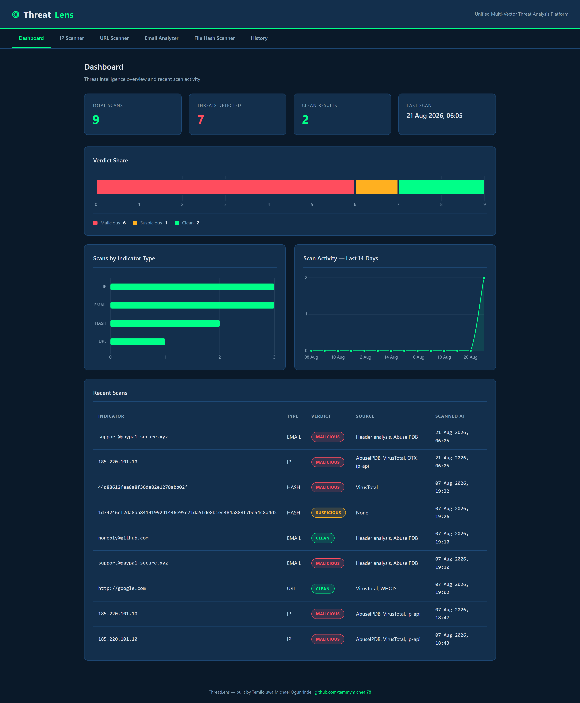
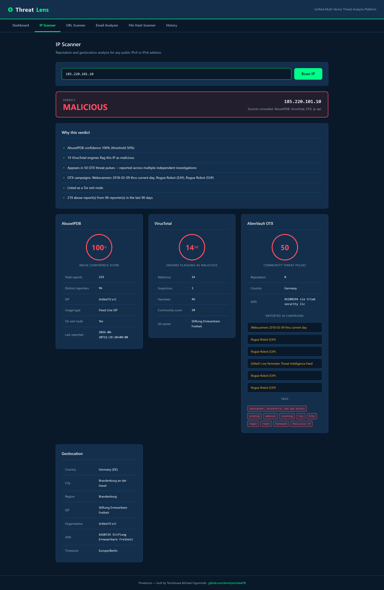
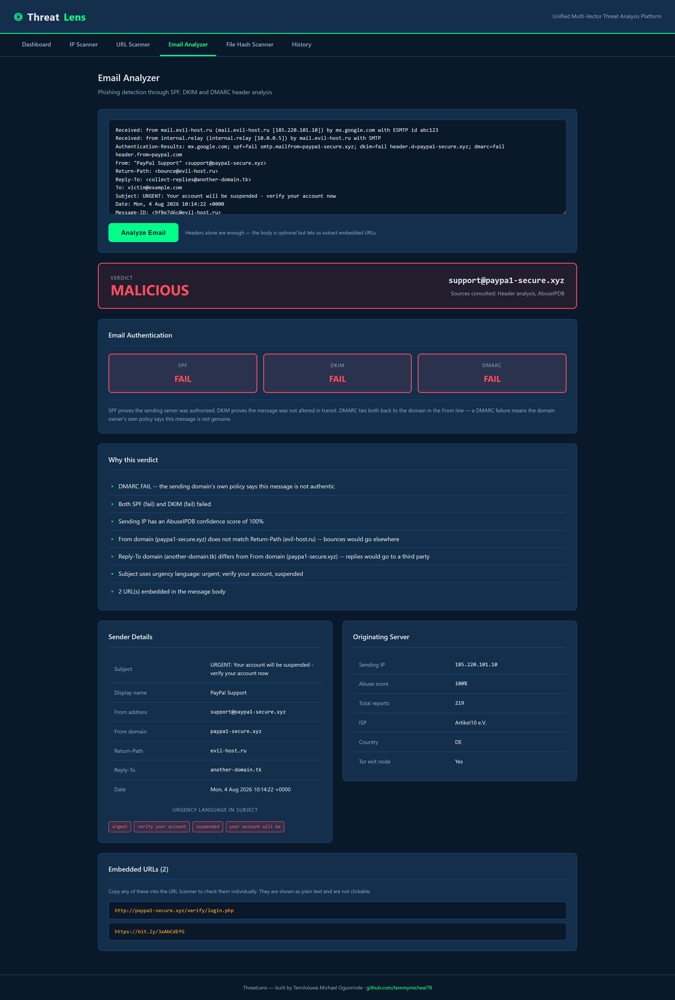

# ThreatLens

**A unified multi-vector threat analysis platform.** Paste any suspicious
indicator &mdash; an IP address, a URL, a raw email, or a file hash &mdash;
and get a security verdict backed by multiple threat intelligence sources,
with a plain-English explanation of how that verdict was reached.

Built to mirror the daily triage work of a SOC analyst.

<!-- After deploying, replace the line below with your live URL -->
<!-- **Live demo:** https://threatlens.onrender.com -->

---

## Contents

1. [Why this exists](#why-this-exists)
2. [What it does](#what-it-does)
3. [Screenshots](#screenshots)
4. [Detection logic](#detection-logic)
5. [Architecture](#architecture)
6. [Setup](#setup)
7. [Tech stack](#tech-stack)
8. [Design decisions](#design-decisions)
9. [Limitations](#limitations)

---

## Why this exists

My MSc dissertation built an automated SSH brute-force detection framework
that operated purely at the network layer: it watched authentication logs,
identified attacking IPs using a sliding-window algorithm, checked their
reputation, and blocked them via `iptables`. Across 20 trials it achieved a
100% detection rate with a 9.8 second mean response time and zero false
positives.

That system answered one question well: *is this IP attacking my SSH
service?*

ThreatLens generalises the approach. Real intrusions rarely arrive through a
single vector &mdash; a phishing email carries a URL, that URL drops a file,
that file calls home to an IP. This platform triages all four indicator
types through one interface, using the same evidence-based verdict model.

---

## What it does

### IP Scanner
Reputation and geolocation for any public IPv4 or IPv6 address.

- **AbuseIPDB** &mdash; abuse confidence score (0&ndash;100), report count,
  distinct reporters, Tor exit node status
- **VirusTotal** &mdash; how many of ~90 engines classify the address as
  malicious
- **AlienVault OTX** &mdash; community threat pulses, naming the campaigns
  the address has been reported under
- **ip-api.com** &mdash; country, city, ISP, ASN, organisation

### URL / Domain Scanner
Malware and phishing analysis for URLs and bare domains.

- **VirusTotal** &mdash; multi-engine URL analysis, with fresh submission
  for URLs never seen before
- **WHOIS** &mdash; domain age, registrar, name servers

### Email Analyzer
Phishing triage from raw message headers.

- **SPF, DKIM and DMARC** verification from `Authentication-Results`
- **Spoofing detection** &mdash; `From` vs `Return-Path` vs `Reply-To`
  mismatches, and display-name deception
- **Originating IP reputation** &mdash; walks the `Received` chain back to
  the true sender and scores it via AbuseIPDB
- **URL extraction** &mdash; embedded links listed as non-clickable text

### File Hash Scanner
Malware identification by hash reputation.

- Accepts **MD5, SHA-1 or SHA-256**
- Or takes a file and **hashes it locally** &mdash; the file itself is never
  uploaded, only its fingerprint is looked up
- Returns engine detections, threat family classification, and file metadata

### Dashboard
Every scan is written to a SQLite audit trail: total scans, threats
detected, clean results, and a recent-scan history with colour-coded
verdicts.

---

## Screenshots

**Dashboard** &mdash; verdict share, indicator types, and 14-day scan activity
over real scan history.



**IP Scanner** &mdash; a live scan of `185.220.101.10`, a Tor exit node.
AbuseIPDB, VirusTotal and AlienVault OTX all agree, and every panel explains
what it contributed to the verdict.



**Email Analyzer** &mdash; a phishing sample failing SPF, DKIM and DMARC, with
sender spoofing, urgency language and embedded URLs broken out.



---

## Detection logic

Every module reduces multiple signals to one of three verdicts, and always
reports *why*.

| Verdict | Meaning |
|---|---|
| `MALICIOUS` | At least one authoritative source confirms a threat |
| `SUSPICIOUS` | Indicators warrant analyst attention, but are not conclusive |
| `CLEAN` | No source flagged the indicator |

**Thresholds** live in [`config.py`](config.py) rather than being scattered
through the code:

| Setting | Value | Rationale |
|---|---|---|
| AbuseIPDB malicious | &ge; 50% | Validated across 20 dissertation trials with zero false positives |
| AbuseIPDB suspicious | &ge; 20% | Elevated but inconclusive |
| VirusTotal malicious | &ge; 3 engines | Single-engine hits are frequently false positives |
| OTX malicious | &ge; 3 pulses | One pulse may be a single researcher's sweep; several mean the address keeps resurfacing independently |
| Domain age high risk | &lt; 7 days | Phishing infrastructure is typically days old |
| Domain age suspicious | &lt; 30 days | Legitimate businesses rarely operate on brand-new domains |

**Escalation is deliberately asymmetric.** Any single source calling an
indicator malicious is enough to escalate. In triage, missing a real threat
costs far more than investigating a false positive.

---

## Architecture

```
                        Flask (app.py)
                              |
        +---------------------+---------------------+
        |                     |                     |
   modules/              threat_intel/          database.py
   ip_scanner            abuseipdb                 |
   url_scanner           virustotal            SQLite audit
   email_analyzer        geolocation              trail
   file_scanner          whois_lookup
        |                     |
   validate input        query source
   combine signals       normalise response
   decide verdict        degrade on failure
```

**Separation of concerns:** `threat_intel/` clients know how to talk to one
API each and nothing about verdicts. `modules/` know how to weigh evidence
and nothing about HTTP. Adding a new intelligence source means writing one
client; adding a new indicator type means writing one module.

```
threatlens/
├── app.py                  Flask routes
├── config.py               API keys and detection thresholds
├── database.py             SQLite persistence
├── modules/                verdict logic per indicator type
├── threat_intel/           one client per intelligence source
├── templates/              Jinja2 pages
├── static/style.css        dark cyber theme
└── samples/                example emails for testing
```

---

## Setup

**Requirements:** Python 3.10+

```bash
git clone https://github.com/temmymicheal78/threatlens.git
cd threatlens
pip install -r requirements.txt
```

**API keys** &mdash; both are free:

| Service | Where | Free tier |
|---|---|---|
| AbuseIPDB | [abuseipdb.com](https://www.abuseipdb.com) &rarr; Account &rarr; API | 1,000 checks/day |
| VirusTotal | [virustotal.com](https://www.virustotal.com) &rarr; Profile &rarr; API Key | 500/day, 4/min |

Copy `.env.example` to `.env` and paste them in:

```
ABUSEIPDB_API_KEY=your_key_here
VIRUSTOTAL_API_KEY=your_key_here
```

Then run it:

```bash
python app.py
```

Open <http://127.0.0.1:5000>.

Geolocation and WHOIS need no key. Without API keys the app still runs and
tells you which sources are unavailable, rather than failing.

**Testing the Email Analyzer:** paste the contents of
[`samples/phishing_example.eml`](samples/phishing_example.eml) or
[`samples/legitimate_example.eml`](samples/legitimate_example.eml).

---

## Testing

```bash
pip install pytest
python -m pytest tests -q
```

**155 tests**, covering input validation, verdict logic for all four
indicator types, database persistence and filtering, and every route.

The suite makes **no network calls**. Verdict functions are pure &mdash;
they take intelligence responses as plain dictionaries and return a verdict
&mdash; so every decision path is tested deterministically without API keys,
rate limits, or an internet connection.

Two guard tests in `tests/test_safety.py` assert that the suite is writing to
a throwaway database and that the real scan history is untouched. Without
them, running the tests would quietly write test data into real scan
records.

The suite has already earned its place: it caught an ordering bug where two
scans saved within the same second were returned newest-last, because
second-precision timestamps made `ORDER BY scanned_at` ambiguous.

## Tech stack

**Backend:** Python, Flask, SQLite
**Frontend:** HTML5, CSS3, Jinja2 templates, Chart.js
**Intelligence:** AbuseIPDB, VirusTotal, AlienVault OTX, ip-api.com, WHOIS
**Testing:** pytest
**Deployment:** gunicorn on Render

---

## Design decisions

**Failures degrade, they do not crash.** Every intelligence client returns a
dict with an `available` flag rather than raising. If VirusTotal is
rate-limited, that panel explains why and the scan continues with the
remaining sources. A scanner that dies because one of three APIs hiccuped is
useless in an operations centre.

**Unknown is never reported as clean.** A file hash VirusTotal has never
seen returns `SUSPICIOUS`, not `CLEAN`. Absence of evidence is not evidence
of absence &mdash; targeted malware is unknown to public reputation services
by design. The same applies to failed lookups: an unanswered question is not
a clean result.

**Files are hashed locally.** The upload path computes MD5, SHA-1 and
SHA-256 in memory and transmits only the hash. A suspicious file may contain
confidential data, and uploading it to a public multi-scanner where it
becomes downloadable would itself be a data breach.

**Every verdict is explained.** No module returns a bare label. Each returns
an ordered list of the evidence behind it, including evidence that did not
change the outcome, because an analyst writing up an incident needs the full
picture.

**Secrets never enter version control.** Keys load from environment
variables via `.env`, which is git-ignored. `.env.example` documents what is
needed without exposing anything.

**Debug mode is gated.** Flask's debugger permits arbitrary code execution;
it defaults on locally and is unreachable in production.

---

## Limitations

Honest constraints of the current build:

- **Free-tier rate limits.** VirusTotal allows 4 requests per minute; rapid
  successive scans will be throttled.
- **No persistent storage in production.** Render's free tier has an
  ephemeral filesystem, so scan history resets on redeploy. Production would
  use managed PostgreSQL.
- **Email analysis trusts the receiving server.** SPF, DKIM and DMARC
  results are read from headers written by the recipient's mail server. If
  that server did not perform the checks, they cannot be recovered from the
  message alone.
- **WHOIS coverage is uneven.** Some registries and privacy services return
  sparse records, so domain age is not always available.
- **No authentication.** The app is a single-user analysis tool with no
  login layer.

---

## Author

**Temiloluwa Michael Ogunrinde**
MSc Networking and Cybersecurity, London Metropolitan University
[github.com/temmymicheal78](https://github.com/temmymicheal78)
